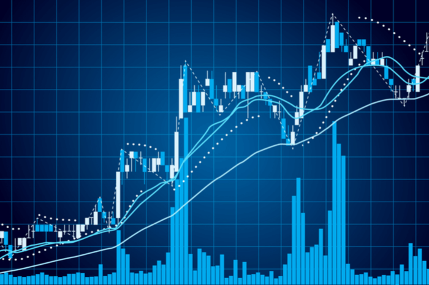

### Stock-Mining---Alpha-Prediction
Prediction of Alpha Score for stocks by using seven given influential factors and the Sentimental score Predicted for the Tweets extracted from Stock twist.

### Data Provided: 
Factors data (ML), Tweets from Stock twist (NLP).

### Data Pre-processing: 
Performing pre-processing steps like stop word removal and lemmatization etc using Spacy.
Followed by Data segmentation and merging of predicted sentimental score based on given time streak.

### Approach: 
Predicted the polarity (Text Blob) and sentiment score for the Tweets using Random Forest.
Merged the predicted sentiment score along with the seven factors to predict Alpha value	
Applied XG Boost in final data frame for predicting the Alpha score for the stocks provided.

### Outcome:  
Analysis done by both including and neglecting the sentiment score for getting better result in Alpha value. As a result, the sentiment score came out to be one of the key factors influencing the Alpha score of a stock, which contributed 2% in predicting the alpha value
